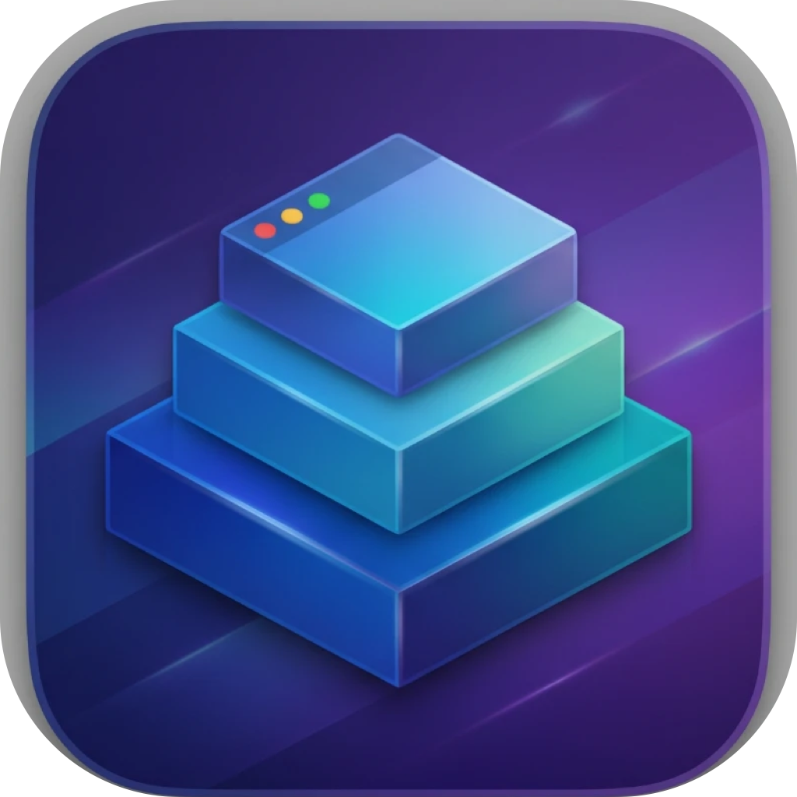

<div align="center">
  

  # PODIUM

  A window switcher and positioner for macOS, built entirely on public
  Accessibility and CoreGraphics APIs.
</div>

---

One hotkey (**⌥⇥**) opens the **Bühne** — a flat, searchable list of every
window, grouped by app. Pick one with the arrow keys, mouse hover, or by
typing to filter, then confirm to jump straight into **Loop mode**: a
Loop-style radial menu that positions that window on screen, driven by mouse
or keyboard, with a live preview and instant commit.

Unlike snap tools (Rectangle), always-on tilers (AeroSpace, yabai) or
switchers (AltTab), PODIUM combines *switch + position* into one continuous
gesture — and does it without private frameworks, SIP disabling, or event
taps. Every window move goes through `AXUIElementSetAttributeValue`, nothing
else.

## How it works

**Bühne (the stage)**
Three ways to pick a window, freely mixable: arrow keys, typing to filter, or
just hovering the real window on its real monitor — the currently active
window is pre-selected on open. The selected window gets a live highlight
border on its real monitor and is briefly raised to the front so you can
actually see it; deselecting slides it right back where it was. A click on
a hovered real window confirms it exactly like Enter, without the click
leaking into the window underneath first.

**Loop mode**
Confirming a selection opens a radial ring on the window's monitor. Move the
mouse anywhere in the matching quadrant (no need to stay inside the ring —
it follows you to another monitor too) or use the keyboard:

| Keys | Action |
|---|---|
| `← → ↑ ↓` (repeat cycles) | edge: half → third → two-thirds |
| `U I J K` (repeat cycles) | corners: ½ → ⅓ → ⅔ |
| `E` / `⇧E` | more positions (center-half/-third, quarter-stripes) |
| `F` / right-click | cycle fill: solo → 3 largest neighbors → all neighbors |
| `M A H W C` | maximize / almost-maximize / full height / full width / center |
| `Z` / `⇧Z` | minimize / minimize others |
| `X` | hide app · `S` / `⇧S` stash / unstash · `⌘Z` undo |
| `1–9` | throw to display N · `⇥` / `⇧⇥` neighbor display |
| `↵` or click anywhere | commit · `esc` back to the stage |

A click or Enter applies the highlighted position immediately, with haptic
feedback on every zone change. Escape backs out without touching the window.

**Interaction model — your choice.** By default, Enter/click open Loop mode
and `⌘↵`/double-click just switch focus; flip a setting to invert it
(Enter/click switch like a classic app switcher, `⌘↵` opens Loop mode). In
both modes, Space checks a window for **Auto-Arrange**: check two or more,
then Enter tiles them across every connected monitor proportional to screen
area, near-square per monitor.

## Features

- **Loop-mode positioning** — halves, thirds, two-thirds, quarters with
  cycling, corners with cycling, center variants, quarter-stripes, maximize
  family, hide/minimize, stash/unstash, undo, and per-display throwing —
  all from one radial menu, mouse or keyboard.
- **Fill neighbors** — positioning a window against an edge or corner can
  fill the remaining space with other windows on the same display too, live
  cycled with `F` or right-click: solo → the 3 largest neighbors → all of
  them in a near-square auto-grid. The live preview always shows every
  window that would move, not just the dragged one.
- **Auto-Arrange** — check two or more windows on the stage (Space, or the
  checkbox on each tile) and Enter tiles them across every connected
  monitor, window count split proportional to screen area, near-square per
  monitor.
- **Linked edges** — hold **⌃ (Control)** while dragging a real window's
  edge and its real neighbors resize along with it (Shift/Option/⌘ are all
  already claimed by macOS for resize gestures, so ⌃ is the one modifier
  left). Neighbors are determined geometrically on every resize (who's
  actually adjacent right now), not from stale bookkeeping — works for
  windows arranged by PODIUM *or* dragged into place by hand.
- **Drag-to-edge snap** — drag a window to a screen edge on the real desktop
  and it snaps like Aero Snap, independent of the overlay.
- **Configurable direct hotkeys** — bind any layout (halves, thirds,
  corners, maximize variants, undo, monitor throw) to its own global
  shortcut, no overlay needed. Settings → Hotkeys.
- **Per-window actions on the stage** — `⌘M` minimize, `⌘H` hide app,
  `⌘⌫` close, or right-click a tile for a full menu including quitting the app.
- **Layout presets** — save a window arrangement per monitor setup
  (fingerprinted by screen names + resolutions), auto-restored when you
  dock/undock. "Apply and launch apps" (menu bar or Settings → Layouts)
  starts any saved app that isn't running yet before positioning everything.
- **Wake restore** — the last known-good arrangement re-applies itself after
  sleep/wake or a display reconnect.
- **Floating apps** — Finder and System Settings (configurable) are never
  tiled; positioning them just centers them.
- **Monitor number badges** — a Liquid Glass badge (macOS 26+, translucent
  fallback on earlier systems) marks each display's number while the
  overlay is open.

## Install

Build from source (requires Xcode command line tools, macOS 14+):

```sh
git clone https://github.com/cowhen/podium.git
cd podium
./build.sh
open Podium.app
```

Or grab `Podium-*.zip` from the [releases](https://github.com/cowhen/podium/releases).
Release builds are ad-hoc signed: macOS will warn on first launch —
right-click → Open once.

### Permissions

PODIUM needs two permissions, requested on first launch:

- **Accessibility** — to read and move windows (the entire mechanism).
- **Screen Recording** — for the window thumbnails only. Without it you get
  app icons instead.

Note for developers: `build.sh` signs with a persistent self-signed identity
(`ScrollWM Local`) if present, so TCC grants survive rebuilds. With ad-hoc
signing you must re-grant permissions after every build.

## Configuration

Everything lives in the Settings window (menu bar icon → Einstellungen):

- **Allgemein** — the Bühne hotkey, interaction model (switch-first vs.
  position-first), auto-minimize, linked edges, fill-neighbors, drag-to-edge.
- **Hotkeys** — bind or clear a global shortcut per layout.
- **Darstellung** — grouping, tile size, per-monitor accent colors.
- **Apps** — ignored apps, floating apps.
- **Layouts** — saved per-setup arrangements.

Or edit `~/.config/podium/config.json` directly: ignore lists by app name,
bundle id or title pattern; floating apps.

## Development

```sh
swift test        # pure-logic tests: layout math, linked-edges geometry,
                   # loop-action frames, window history
./build.sh         # release build + app bundle + signing
```

The interaction core is split into small, pure, fully unit-tested modules
with no AppKit/Accessibility dependency — `Layout`, `BentoLayout`,
`LoopEngine`, `LinkedEdges.computeNeighborUpdates` — each wired to the real
window server by a thin AX layer (`AX.swift`, `WindowManager.swift`).
`OverlayController` orchestrates the stage and Loop mode on top of that.

## License

GPLv2 — see [LICENSE](LICENSE).
